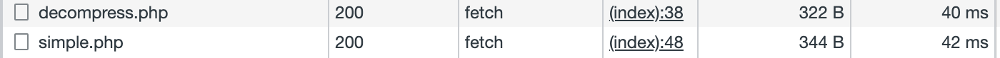
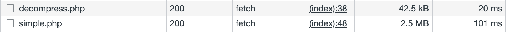
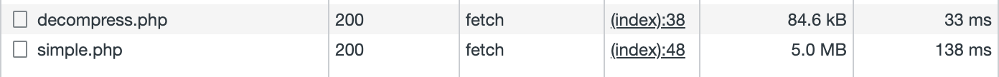
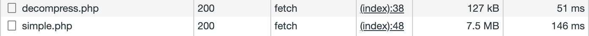

# Demo: pako.js + php zlib fetch

Project demonstrate ability compress **client (browser) -> server** request using [pako.js](https://github.com/nodeca/pako) and default [zlib](https://www.php.net/manual/en/function.zlib-decode.php) php library.


## Code

### Client side (browser)

```js
//https://cdnjs.cloudflare.com/ajax/libs/pako/2.1.0/pako.min.js

const data = {a: 1, b: 2} //request data
fetch("server/decompress.php", {
  method: "POST",
  headers: {
    "Content-Type": "text/plain;charset=UTF-8",
  },
  body: pako.deflate(JSON.stringify(data)),
});
```

### Server side

```php
$data = file_get_contents('php://input');
$data = json_decode(zlib_decode($data));
var_dump($data);
```

## Tests

Tests performed using compression functional and non-compressed requests.
Images below are screenshots from google chrome network inspector after requests done.

### Request data 344b



### Request data 2.5mb



### Request data 5mb



### Request data 7.5mb



### Request data 10mb


# Environment

- PHP 7.2.34
- pako.js 2.1.0
- Google Chrome 107.0.5304.110 (Official Build) (x86_64)